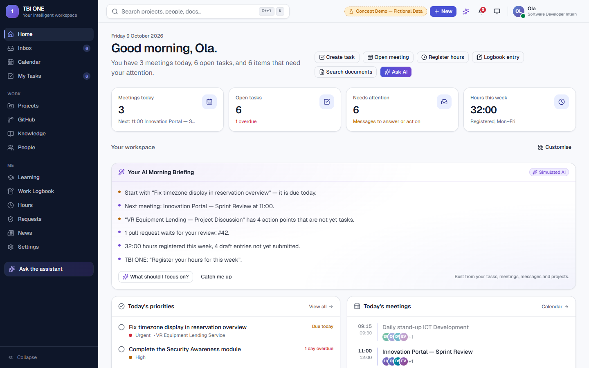

# TBI ONE: your intelligent workspace

An independent concept demo of a single employee workspace that brings meetings, tasks, projects, GitHub, documents, people, learning, hours and an AI assistant together in one place.

> **Disclaimer.** This is an unofficial, experimental concept built by an MBO-4 software development intern as a portfolio project. It is not a TBI product and has no approval from TBI or any of its companies. Every person, project, message, document and number in it is fictional. It does not connect to Microsoft 365, Teams, Outlook, SharePoint, GitHub or any company system, and it uses no official branding.



## Why this exists

Employees at a large organisation already have good tools: Teams, Outlook, SharePoint, GitHub, Copilot, Claude, time registration, learning platforms. The friction sits between those tools. A developer's normal day looks like this:

1. Join a Teams meeting and read the AI summary afterwards.
2. Copy the summary into an AI chat to pull out the tasks.
3. Open GitHub and type the issues by hand.
4. Check Outlook for mail, go back to Teams to ask a colleague something.
5. Update the project tool, register hours somewhere else, write the logbook in a third place.

Each step means finding information again, copying it, and keeping systems in sync by hand.

TBI ONE explores what happens if each employee gets one personal layer on top of those systems. It does not replace them. It shows the parts of each tool that matter to that person today, links them through one data model, and lets an assistant answer questions and propose actions across all of it. The person stays in control: the assistant suggests, the employee confirms.

## What you can do in the demo

| Module | What it does |
| --- | --- |
| Home | Personal greeting, AI morning briefing, priorities, today's meetings, messages that need you, project progress, hours, approvals, GitHub, learning and an activity feed that names the source of every item. Widgets can be hidden and reordered. |
| Inbox | Simulated Teams, Outlook, GitHub, project, meeting, task, approval and reminder messages in one list, with filters, search, archive, draft replies (never sent) and "create task from message". |
| Calendar | Day, week, month and agenda views. Meeting pages show the simulated AI summary, decisions and action points. |
| Meeting action plan | Turns action points into reviewable task suggestions with an owner, priority and deadline, each with the reason it was suggested and a duplicate check. Confirmed suggestions become tasks and simulated GitHub issues. |
| My Tasks | List and board views, filters, source links (meeting, message, AI insight) and linked issues. |
| Projects | Portfolio cards, project pages with overview, tasks, activity, meetings, documents, decisions, GitHub and AI insights. Restricted projects stay locked. |
| GitHub | Simulated repositories, issues, pull requests, reviews, branches and commits. Issues can be created and closed inside the demo. |
| Assistant | Available on every page (Ctrl+J) and as a full AI workspace. Answers from workspace data with source cards, uses the page you are on as context, and proposes actions you confirm. |
| Knowledge | Fictional documents with categories, tags, search and preview. Restricted documents show only their title. |
| People | Searchable directory with skills, projects, availability and responsibilities. |
| Learning | Skills against targets, goals, courses with lessons you can complete, and recommendations tied to your projects. |
| Work logbook | Daily and weekly entries, search, editing, print layout, and "Generate my work summary". |
| Hours | Weekly registration in Europe/Amsterdam time with breaks, totals, draft, submitted and approved states, and team approval for managers. |
| Requests | Access requests and approvals with notifications and history. |
| News | Personalised fictional news with categories and bookmarks. |
| Search | Ctrl+K searches projects, people, tasks, meetings, documents, issues and logbook entries, grouped, with permissions applied. |

## Demo users

Use the switcher in the top right. It is a simulation, not real sign-in.

| Persona | Role | What changes |
| --- | --- | --- |
| Ola | Software Developer Intern | Development tasks, learning goals, logbook, hours, two projects. No access to the Smart Building Platform. |
| Daan Verhoef | Software Developer | Review requests, pull requests, more projects including Smart Building. |
| Sanne de Wit | Team Lead ICT Development | Team workload, access approvals, timesheet approval. No logbook in the menu. |
| Marco Jansen | Project Manager | Portfolio, risks, decisions, approvals for his projects. |

The dashboard layout, metrics, menu items, visible projects, search results and assistant answers all depend on the persona.

## Five demo workflows

1. **Meeting to GitHub issue.** Open Calendar, then "VR Equipment Lending — Project Discussion". Click *Generate action plan*, review and edit the suggestions, confirm. The tasks appear in My Tasks, on the project, as simulated issues in GitHub and in the dashboard activity feed, each linked to the meeting.
2. **Intelligent morning overview.** Switch persona and watch the dashboard change. Ask the assistant "What should I focus on today?" and follow the source cards.
3. **Permission request.** As Ola, open the Smart Building Platform. It is locked. Request access with a reason, switch to Sanne, approve it in Requests, switch back to Ola and open the project.
4. **Logbook generation.** In Work Logbook, click *Generate my work summary*, edit the draft and save it.
5. **AI project recommendations.** Open the VR Equipment Lending Service, go to *AI Insights*, generate recommendations, read the evidence and convert one into a task.

[docs/DEMO_SCRIPT.md](docs/DEMO_SCRIPT.md) has a 5 to 8 minute walkthrough.

## Getting started

Requirements: Node.js 20 or newer (developed on Node 24) and npm.

```bash
git clone https://github.com/OlaAlkhousi/tbi-one-concept-demo.git
cd tbi-one-concept-demo
npm install
npm run dev
```

Open http://localhost:3000. The demo needs no API keys, accounts or database. Changes are stored in your browser's localStorage. Settings has a *Reset demo data* button so you can run the demo again from the start.

### Scripts

| Command | Purpose |
| --- | --- |
| `npm run dev` | Development server |
| `npm run build` / `npm start` | Production build and server |
| `npm run typecheck` | TypeScript check |
| `npm run lint` | ESLint |
| `npm test` | Unit and workflow tests (Vitest) |
| `npm run test:e2e` | End-to-end tests (Playwright) |

The end-to-end tests use the Microsoft Edge that comes with Windows by default. On another system run `npx playwright install chromium` once and set `PW_CHANNEL=chromium`.

## Tech stack

Next.js 16 (App Router), React 19, TypeScript, Tailwind CSS 4, shadcn/ui on Radix, Lucide icons, Recharts, Zustand, Zod, date-fns with date-fns-tz, cmdk, Sonner, Vitest, Testing Library and Playwright. The optional language model route uses the official Anthropic TypeScript SDK.

## Architecture in short

```
src/
  app/                  Routes (one folder per module) and the optional /api/assistant route
  components/
    shell/              Sidebar, top bar, command palette, notifications, user switcher
    common/             Shared UI: badges, panels, avatars, task and access dialogs
    assistant/          Assistant chat used in the side panel and the AI workspace
    <module>/           Components for one module
  lib/
    types.ts            One shared data model for every module
    data/               Fictional seed data, generated relative to today
    selectors.ts        Derived, permission-aware views of the state
    permissions.ts      Simulated access rules
    search.ts           Permission-aware search index
    hours.ts            Time calculations (Europe/Amsterdam, DST-aware)
    ai/                 Deterministic "AI" engines and the assistant
  store/workspace.ts    Central store; every action keeps the modules connected
```

Every module reads the same store. When an action changes something, the store action also writes the activity item and the notification, so a task created from a meeting shows up in the project, the task list, GitHub and the feed without the pages knowing about each other. [docs/ARCHITECTURE.md](docs/ARCHITECTURE.md) explains the design, including how real Microsoft Graph, Entra ID and GitHub providers would replace the mock data.

## How the AI works

The demo runs on a **deterministic engine**, labelled "Simulated AI" in the interface. No language model is involved. For a question it:

1. recognises the intent (priorities, meetings, project progress, documents, people, hours, drafting, and so on),
2. finds the project, person, skill or day the question is about, using the current page as context,
3. retrieves only records the current user may see,
4. builds an answer with source cards and proposes actions that wait for confirmation.

The meeting action plan, project insights, work summary, learning recommendations and morning briefing are rule-based in the same way, and each result lists the evidence it came from.

An optional **language model mode** exists for later. It is off unless the server has `ASSISTANT_PROVIDER=anthropic` and an `ANTHROPIC_API_KEY` (see `.env.example`). In that mode the deterministic engine still does the retrieval and permission checks, and the model only rephrases the grounded answer. The model never receives raw workspace data and cannot run actions. The demo does not depend on it.

## Permission model

- Internal projects and documents are visible to everyone.
- Restricted projects are visible to their team and to people with an approved access request.
- Restricted documents are readable by named readers, members of a linked project, or people with approved access.
- A manager role does not give access to restricted content, and nobody can see another person's inbox, logbook or assistant conversation. Team leads see team workload and submitted timesheets.
- Search, the assistant, previews, activity and notifications all apply the same rules. A restricted item can only be found by its title, and then shows as locked.

**Security limitation.** These checks run in the browser on fictional data. That is enough to demonstrate the behaviour and nothing more. A production version would enforce authorisation on the server with Microsoft Entra ID identities and groups, and restricted content would never be sent to a browser that may not see it.

## Planned integrations

Microsoft Entra ID for sign-in and groups, Microsoft Graph for mail, calendar, Teams and SharePoint, the GitHub API for repositories, issues and pull requests, an approved enterprise model with retrieval and citations, and the existing time registration, HR, learning and equipment systems. Each would plug in behind a provider interface. See [docs/ROADMAP.md](docs/ROADMAP.md).

## More documentation

- [docs/ARCHITECTURE.md](docs/ARCHITECTURE.md)
- [docs/FEATURES.md](docs/FEATURES.md)
- [docs/DEMO_SCRIPT.md](docs/DEMO_SCRIPT.md)
- [docs/ROADMAP.md](docs/ROADMAP.md)

## Author

Built by Ola, MBO-4 Software Developer student, during an internship, with AI-assisted programming. All content is fictional.
