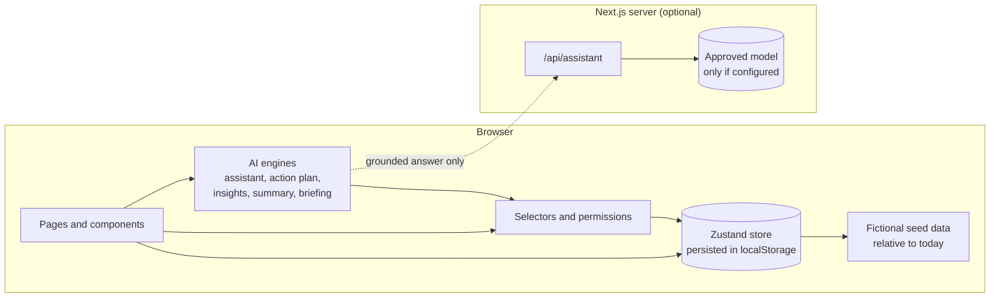

# Architecture

TBI ONE is a Next.js App Router application that runs almost entirely in the browser. That keeps the proof of concept free of servers, databases and credentials, while the code is split so that a backend and real integrations can be added later without rewriting the interface.

## Overview

## Layers

### 1. Data model (`src/lib/types.ts`)

One set of types for every module: `Employee`, `Project`, `Task`, `Meeting`, `Message`, `GithubIssue`, `PullRequest`, `KnowledgeDocument`, `HoursEntry`, `LogbookEntry`, `AccessRequest`, `Notification`, `Activity` and the assistant types. Records point at each other by id. A task has a `source` (meeting, message, insight, assistant or manual) and an optional `githubIssueId`. An issue knows its `taskId` and `meetingId`. That chain of ids is what lets a meeting lead to a task, a task to an issue, and an issue back to the meeting.

### 2. Seed data (`src/lib/data/`)

`people.ts` and `catalog.ts` hold fixed fictional records: people, repositories, documents and courses. `seed.ts` builds everything with a date (meetings, tasks, messages, hours, logbook, activity) relative to the current day, counting in working days. "Yesterday's meeting" is always the previous working day, so the demo looks current whenever it runs. When stored data is from an earlier week the app offers to refresh it.

### 3. Store (`src/store/workspace.ts`)

A single Zustand store holds the workspace state and the current demo user, persisted to `localStorage` under one key. Pages never change state directly. They call named actions such as `createActionPlan`, `createIssue`, `setTaskStatus`, `requestAccess`, `decideAccess`, `submitWeek` and `saveLogbook`.

Actions keep the modules connected. `createActionPlan` creates the tasks, creates or links the GitHub issues, records the follow-up tasks on the meeting, clears the "needs action" flag on the meeting recap message and writes an activity item. `decideAccess` stores the decision, adds an access grant, notifies the requester and logs the activity. Completing a task closes its linked issue.

A second, non-persisted store (`src/store/ui.ts`) holds global dialogs, so any page or the assistant can open the task dialog or the access request dialog.

### 4. Selectors and permissions (`src/lib/selectors.ts`, `src/lib/permissions.ts`)

Selectors are pure functions over the state: `todaysPriorities`, `visibleProjects`, `myActivity`, `projectProgress`, `pendingApprovals`, `workload` and others. Project progress is calculated from tasks and milestones, so it moves as soon as a task is completed.

`permissions.ts` holds the access rules (`canViewProject`, `canViewDocument`, `canViewMeeting`, `canViewRepo`). Search, the assistant, the pages and the activity feed all use the same functions, so a rule changes in one place.

Because these are plain functions without React, the unit tests call them directly.

### 5. AI engines (`src/lib/ai/`)

| File | What it does |
| --- | --- |
| `assistant/engine.ts` | Intent router. Rules match the question, entity detection finds the project, person, skill or day, and a handler builds the answer with source cards and proposed actions. |
| `assistant/entities.ts` | Detects projects (names, codes, aliases), people, skills with synonyms, and days. |
| `assistant/provider.ts` | `AssistantProvider` interface with the local demo provider and the optional language model provider. |
| `meeting-actions.ts` | Action plan: short titles, owner by skills and workload, priority from risks and deadlines, deadline from the next project meeting, duplicate and related-work detection. Every field has a reason. |
| `insights.ts` | Project recommendations from rules over risks, uncovered objectives, reusable features in other projects, overdue tasks, open decisions, bug load, tests and accessibility. Every recommendation lists its evidence. |
| `work-summary.ts` | Weekly logbook draft from completed tasks, meetings, pull requests, issues, lessons and registered hours. It never estimates hours. |
| `learning.ts` | Course recommendations from the technologies in the user's projects and their skill gaps. |
| `briefing.ts` | The morning briefing, different per persona. |

These engines are deterministic. The same state gives the same answer, which makes them testable and honest to label as "Simulated AI".

### 6. Optional language model (`src/app/api/assistant/route.ts`)

The route is disabled unless the server has `ASSISTANT_PROVIDER=anthropic` and `ANTHROPIC_API_KEY`. When enabled, the browser first runs the demo engine, which applies permissions and retrieves the records. Only that grounded answer, with source titles, is sent to the route, and the model is instructed to rephrase it without adding facts. The model never sees the raw workspace and cannot run actions. If the call fails, the user gets the demo answer.

In production the server would do the retrieval itself, using the signed-in user's identity, instead of trusting text sent by the browser.

### 7. Integration seam (`src/lib/integrations/providers.ts`)

Provider interfaces describe what TBI ONE needs from each system: `DirectoryProvider`, `MailProvider`, `CalendarProvider`, `KnowledgeProvider` and `CodeHostProvider`. The demo has mock implementations over the local state, which apply the same permissions as the UI, and a Graph stub that refuses to run. A real provider would:

- run on the server,
- use delegated permissions for the signed-in user, so Outlook, SharePoint and GitHub keep enforcing their own access rules,
- write only after the user confirms.

### 8. User interface

- `components/shell`: sidebar with role-aware items and live counts, top bar, command palette (Ctrl+K), notification centre with "why this matters", demo user switcher, theme switcher.
- `components/common`: badges, panels, stat cards, avatars, the safe Markdown renderer (`RichText` builds React elements and never injects HTML), the task dialog and the access request flow.
- `components/assistant`: the chat used in the side panel (Ctrl+J) and on `/assistant`.
- One folder per module for module-specific components.

The design uses CSS variables defined in `globals.css` for light and dark mode: deep navy, slate, an indigo accent, semantic status colours and a separate violet tint reserved for AI output.

## Data flow example: meeting to GitHub issue

1. The meeting page calls `generateActionPlan(state, meetingId)`.
2. The user edits the suggestions and confirms.
3. `createActionPlan` calls `createTask` for each suggestion, then `createIssue` or links an existing issue.
4. Each of those writes activity and notifications.
5. My Tasks, the project page, the GitHub workspace and the dashboard read the same store and update.

## Production path

| Concern | Demo | Production |
| --- | --- | --- |
| Identity | Persona switcher | Microsoft Entra ID single sign-on |
| Authorisation | Functions in the browser | Server-side checks on Entra ID groups, source-system permissions, access reviews |
| Data | Seed data in localStorage | Graph, GitHub and business systems through server-side providers, cached per user |
| AI | Deterministic engine | Approved enterprise model with permission-aware retrieval, citations and tool calls that need confirmation |
| Audit | Activity feed | Central audit log of AI suggestions, confirmations and access decisions |

## Testing

- Vitest covers time calculations (including daylight-saving changes), permissions, search leakage, the action plan, insights, the work summary, learning, the briefing, assistant intents and permissions, the providers, and the store workflows for demos A and C.
- Playwright covers the five demo workflows, navigation, search, task completion, hours, assistant permissions, reset and phone-width layouts.
